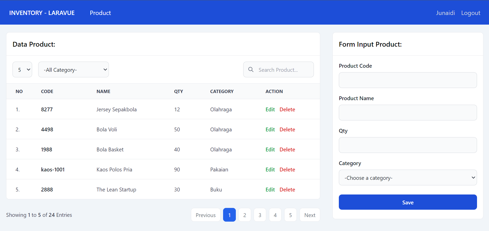

Pada materi kali ini kita akan membahas tentang bagaimana cara penggunaan Spatie media-library di Laravel.

###### Instalasi

Ikuti langkah-langkah di bawah ini untuk melakukan instalasi

```php
composer require spatie/laravel-role-permission
```

###### Publish

Publish file file konfigurasi bawaan dari role permission


